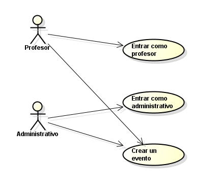
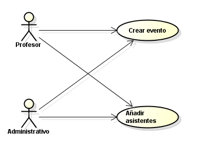

# 📄 Requerimientos del Sistema

## 1. Lista general de requerimientos

El sistema de EventSync tiene los siguientes requerimientos (descripción a alto nivel):

### 1.1 Requerimientos funcionales

El sistema de EventSync debe tener la capacidad de:

1. Permitir que los usuarios puedan hacer la creación de eventos que deseen, siempre y cuando tengan los permisos necesarios para poder realizarlo.
2. Permitir que los usuarios puedan realizar la inscripción de los asistentes en cada uno de los eventos que creen.

## 2. Diagramas de caso de uso

### 2.1 Requerimiento Funcional 1

| Campo | Descripción |
|------|-------------|
| **ID** | RF-01 |
| **Nombre del requerimiento** | |
| **Descripción** | *El sistema debe permitir que, dependiendo de cada uno de los permisos de los usuarios que quieren crear un evento puedan realizarlo* |
| **Precondiciones** | *Para que el sistema cumpla con este requerimiento, EventSync debe tener previamente los roles de los usuarios y sus permisos designados* |
| **Actor** | *Usuario: profesor o administrativo* |
| **Flujo principal** | 1. El usuario (profesor o administrativo) entra al sistema.  2. El usuario crea un evento   3. El sistema verifica si tiene los permisos necesarios para que pueda crear el evento. |
| **Diagrama de caso de uso** | **|
| **Poscondiciones** | *Se espera como resultado que el usuario pueda crear el evento sin inconvenientes en caso de tener los permisos, de lo contrario no se crea el evento* |

### 2.2 Requerimiento Funcional 2

| Campo | Descripción |
|------|-------------|
| **ID** | RF-02 |
| **Nombre del requerimiento** | |
| **Descripción** | *El sistema debe permitir al usuario que crea el evento añadir asistentes.* |
| **Precondiciones** | *Para que el sistema cumpla con este requerimiento, EventSync debe tener previamente la lista de personas posibles que pueden ser añadidas al evento.* |
| **Actor** | *Usuario (profesor o administrativo) y persona que es inscrita (otro usuario)* |
| **Flujo principal** | 1. El usuario crea el evento. 2. El usuario añade los integrantes.  3. El sistema adiciona al evento todos los integrantes seleccionados. |
| **Diagrama de caso de uso** | **|
| **Poscondiciones** | *Se espera como resultado el evento se crea con los participantes* |

