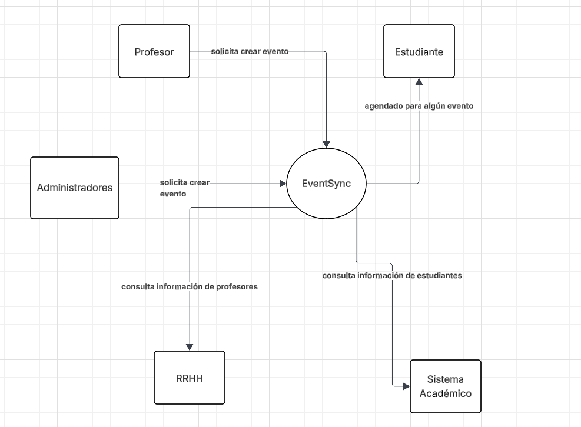

# DOSW_ParcialT1_PaulaLozano

## 1. Diagrama de contexto

En este diagrama identificamos los principales actores que interactúan con el sistema EventSync. Cada uno juega un rol diferente, incluyendo los actores externos que reciben los datos.

## 2.Identificando patrones.

### Primer patrón
**Nombre:**  Strategy 

**Tipo:** Patrón de comportamiento

**Justificación:** En el texto vemos que no todos los usuarios pueden crear cualquier evento, algunos pueden crear ciertos tipos que otros no pueden. Strategy nos permite que el usuario pueda realizar únicamente sus operaciones previamente definidas y permitidas, aliviando la complejidad de usar if-else.

### Segundo patrón
**Nombre:** Adapater

**Tipo:** Patrón estructural

**Justificación:** Los usuarios externos que son los sistemas que entregan datos a EventSync. EventSync recibe estos datos por parte del Sistema académico y RRHH con ciertos formatos como lo son: codigo,nombre,correo y dEnlace_nombre_correo_programa, pero únicamente acepta los que terminen en  @escuelaing.edu.co y  @mail.escuelaing.edu.co, respectivamente.

También podríamos usar patrones como observer para el tema de notificaciones y y Factory en complemento de Strategy para manejar los tipos de eventos.

## 3. Requerimientos.

### Requerimientos funcionales
1. Los usuarios deben poder hacer la creación de eventos que deseen, siempre y cuando tengan los permisos necesarios para poder realizarlo.
2. Los usuarios deben poder realizar la inscripción de los asistentes en cada uno de los eventos que creen.
3. Se debe notificar cambios relevantes del evento a los inscritos en este mismo. Estos cambios incluyen:  
● El evento cambia de estado a CONFIRMADO  
● El evento es CANCELADO  
● Se modifica la fecha/hora de inicio  
● Se alcanza el cupo máximo

### Requerimientos no funcionales
No vi explícitamente requerimientos no funcionales definidos en el texto, pero en general podría agregar estos:

1. La paleta de colores de la página acorde a la Universidad.  
2. Que sea responsivo para que desde diferentes dispositivos se pueda acceder sin inconvenientes.

*Nota:* El requerimiento funcional que utiliza uno de los patrones dichos es el requerimiento 1, es aquí donde desginamos que los usuarios tengan los permisos necesarios para poder realizar cierta acción. Con el pátrón Strategy manejamos la dinámica que tiene cada usuario.

