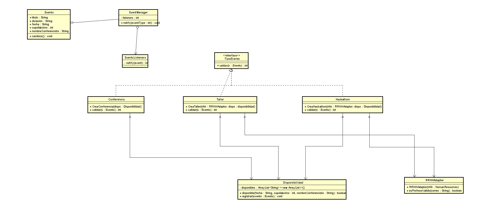

# DOSW_ParcialT1_PaulaLozano

## 1. Diagrama de contexto

En este diagrama identificamos los principales actores que interactúan con el sistema EventSync. Cada uno juega un rol diferente, incluyendo los actores externos que reciben los datos.

## 2.Identificando patrones.

Cuando habías dicho lo de los patrones ya había escrito estos. Siguen cumpliendo la lógica y explico por qué los elegí, los había pensado más que todo por la implementación.

### Primer patrón
**Nombre:**  Strategy 

**Tipo:** Patrón de comportamiento

**Justificación:** En el texto vemos que no todos los usuarios pueden crear cualquier evento, algunos pueden crear ciertos tipos que otros no pueden. Strategy nos permite que el usuario pueda realizar únicamente sus operaciones previamente definidas y permitidas, aliviando la complejidad de usar if-else.

### Segundo patrón
**Nombre:** Adapater

**Tipo:** Patrón estructural

**Justificación:** Los usuarios externos que son los sistemas que entregan datos a EventSync. EventSync recibe estos datos por parte del Sistema académico y RRHH con ciertos formatos como lo son: codigo,nombre,correo y dEnlace_nombre_correo_programa, pero únicamente acepta los que terminen en  @escuelaing.edu.co y  @mail.escuelaing.edu.co, respectivamente.

También podríamos usar patrones como observer para el tema de notificaciones y y Factory en complemento de Strategy para manejar los tipos de eventos.

## 3. Requerimientos.

### Requerimientos funcionales
1. Los usuarios deben poder hacer la creación de eventos que deseen, siempre y cuando tengan los permisos necesarios para poder realizarlo.
2. Los usuarios deben poder realizar la inscripción de los asistentes en cada uno de los eventos que creen.
3. Se debe notificar cambios relevantes del evento a los inscritos en este mismo. Estos cambios incluyen:  
● El evento cambia de estado a CONFIRMADO  
● El evento es CANCELADO  
● Se modifica la fecha/hora de inicio  
● Se alcanza el cupo máximo

### Requerimientos no funcionales
No vi explícitamente requerimientos no funcionales definidos en el texto, pero en general podría agregar estos:

1. La paleta de colores de la página acorde a la Universidad.  
2. Que sea responsivo para que desde diferentes dispositivos se pueda acceder sin inconvenientes.

*Nota:* El requerimiento funcional que utiliza uno de los patrones dichos es el requerimiento 1, es aquí donde desginamos que los usuarios tengan los permisos necesarios para poder realizar cierta acción. Con el pátrón Strategy manejamos la dinámica que tiene cada usuario.

## 4. Diagramas de caso de uso

Escogí los requerimientos funcionales 1 y 2.

## Historia de usuario 1
Como usuario con posibilidad de crear eventos, quiero crear cierto tipo de evento según mis permisos para poder realizar las actividades que tengo propuestas.

## Hisotria de usuario 2
Como usuario que ha creado un evento teniendo los permisos, quiero poder agregar a los asistentes para llevar registro de la participación de ellos en las actividades propuestas.

*Nota:* El requerimiento 1 es que utiliza el patrón Strategy previamente definido.

# 6. Descomposición de tareas

## Desglose de trabajo: Épicas, Historias de Usuario y Tareas

### 1. Épica:

| Campo | Descripción |
|------|-------------|
| **ID** | EP-01 |
| **Título** | Creación de evento |
| **Descripción** | *Es el objetivo del sistema* |
| **Stakeholder** | *Los usuarios que crean los eventos y quienes participan en ellos* |

### 2. Historias de usuario:

| Campo | Descripción |
|------|-------------|
| **ID** | HU-01 |
| **Título** | Solicitud de creación de evento por parte del usuario|
| **Descripción** | *Como usuario con posibilidad de crear eventos, quiero crear cierto tipo de evento según mis permisos para poder realizar las actividades que tengo propuestas.* |
| **Prioridad** | *[Alta] Debido a que es una función objetivo del sistema* |

### 3. Tareas:

| Campo | Descripción |
|------|-------------|
| **ID** | TR-01 |
| **Título** | Definir los roles de los usuarios|
| **ID de la Historia de Uso asociada** | HU-01 |
| **Descripción** | *Se debe definir los roles de los usuarios* |
| **Tareas requisito** | *Ninguna* |

| Campo | Descripción |
|------|-------------|
| **ID** | TR-02 |
| **Título** | Definir los permisos de cada usuario|
| **ID de la Historia de Uso asociada** | HU-01 |
| **Descripción** | *Cada usuario tiene ciertos permisos asignados* |
| **Tareas requisito** | *TR-01* |

| Campo | Descripción |
|------|-------------|
| **ID** | TR-02 |
| **Título** | Crear un evento|
| **ID de la Historia de Uso asociada** | HU-01 |
| **Descripción** | *Crear un evento que el usuario pida una vez validados sus permisos* |
| **Tareas requisito** | *TR-02* |

